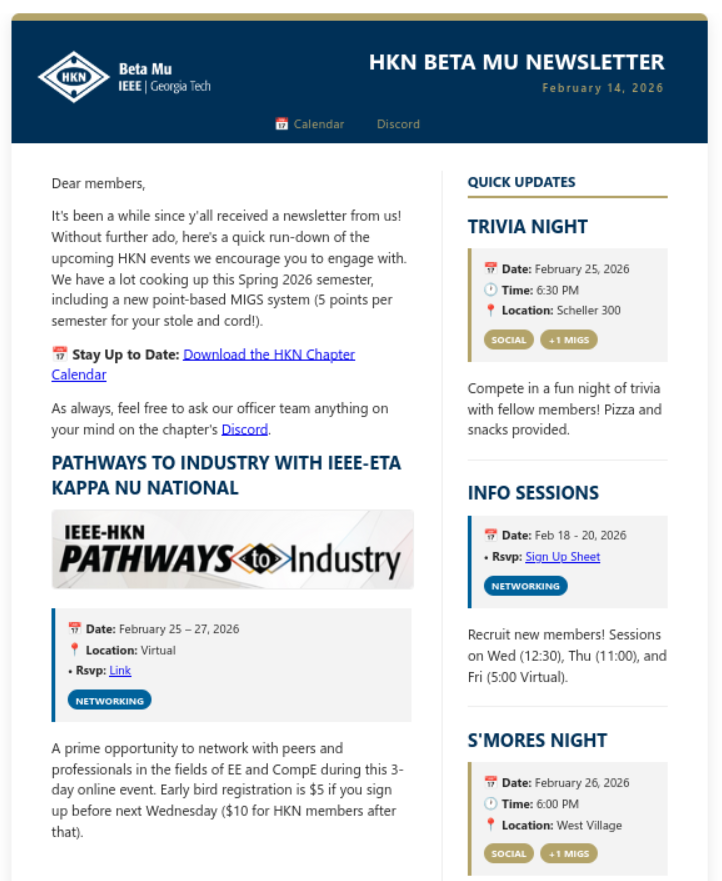

# Newsletter generator for the Beta Mu chapter



## Setup

Make sure you have a [conda](https://www.anaconda.com/docs/getting-started/miniconda/main) distribution installed, and create your environment with:

```console
conda env create -f hkn-news.yml
```

And then activate it:

```console
conda activate hkn-news
```

## Writing the Newsletter

Edit `content.md`. Sections are seperated by titles (# ). Look at the current example for inspiration. Adding (Sidebar) in the title puts that section in the sidebar.

## Generating the HTML

Simply execute:

```console
(hkn-news) z@latitude:~/hkn-news$ python newsletter.py content.md 
Newsletter generated successfully → news.html
```

## Sending HTML in Outlook

Here is a tutorial you might find useful: [https://www.youtube.com/watch?v=fUm8UC8ckhM](https://www.youtube.com/watch?v=fUm8UC8ckhM).

And enjoy!